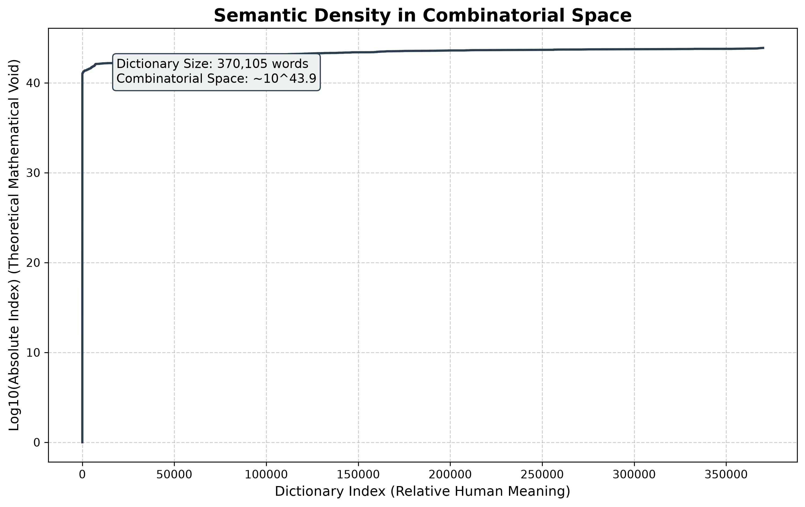

# Semantic Density in Combinatorial Space

A mathematical experiment that measures how "densely" human vocabulary fills the space of all possible letter strings.

## Overview

In computational linguistics, we deal with strings of characters. Given an alphabet of 26 letters and a maximum string length of 31 (the length of the longest purely alphabetical English word, `dichlorodiphenyltrichloroethane`), there are mathematically **7.6 x 10^43** possible letter combinations of that length or shorter.

Generating all of them is physically impossible — the number is far larger than the count of stars in the observable universe. This project instead uses a pure mathematical approach (26-ary combinatorial suffix trees) to calculate the exact position of any real word within that theoretical space, without ever generating the space itself.

## Why

Every real word is one point in an astronomically large space of possible letter strings, but almost none of that space is ever used. The question this experiment asks is: is the small slice of "real" words scattered randomly through that space, or does it follow a pattern? Plotting where real dictionary words fall against where they theoretically could fall turns an abstract combinatorics fact into something you can actually see.

## Features

- Computes the exact absolute lexicographical index of a word within the full combinatorial space of a given max length, in O(word length) time, without enumerating the space.
- Downloads and processes a ~370,000-word English dictionary.
- Plots the relative dictionary index against the absolute combinatorial index on a logarithmic scale.
- Produces a single, saved chart image summarizing the result.

## The Finding



The resulting curve is remarkably linear on a logarithmic scale. This shows that human language expands into combinatorial space exponentially and predictably. The subtle "wobbles" or steps in the curve are gravitational anomalies in language: human biases toward certain common prefixes (like `re-` or `con-`) that cluster thousands of words tightly together while leaving vast unused stretches of the mathematical space nearby.

## Tech Stack

- Python 3
- `matplotlib` for plotting
- Standard library only otherwise (`urllib`, `math`)

## How It Works

1. Download the dictionary word list (`words_alpha.txt` from the `dwyl/english-words` dataset).
2. Clean it: lowercase, alphabetic-only, deduplicated, sorted.
3. Find `M`, the length of the longest word, and precompute `P(L)` — the count of all possible strings of length up to `L` — for every `L` from 0 to `M`.
4. For each word, walk its letters left to right. At each position, every letter that comes alphabetically before the actual letter accounts for a whole skipped subtree of `P(remaining length)` possible strings; summing these skipped subtrees plus one for the word itself gives its exact index in the full combinatorial ordering — this is the core trick that avoids ever generating the 10^43-sized space.
5. Plot dictionary rank (x-axis) against `log10(absolute index)` (y-axis) and save the chart.

## Installation

```bash
git clone https://github.com/JampaniKomal/semantic-density.git
cd semantic-density
python -m venv venv
venv\Scripts\activate        # on Windows; use `source venv/bin/activate` on Linux/macOS
pip install matplotlib
```

## Usage

```bash
python semantic_density.py
```

This downloads the dictionary dataset, computes the absolute combinatorial index for all ~370,000 words, and writes `semantic_density_curve.png` to the repository root (overwriting the existing one).

## Known Limitations

- Requires an internet connection every run — the dictionary is downloaded fresh each time rather than cached locally.
- Assumes an all-lowercase, purely alphabetic 26-letter alphabet; words with hyphens, apostrophes, or non-English characters are filtered out during cleaning.
- Single-script, no automated tests — correctness was verified by running it end-to-end and checking the printed word count, max length, and space size against the numbers described above.

## License

MIT License — see [LICENSE](LICENSE).

## Acknowledgments

- Dictionary data from [dwyl/english-words](https://github.com/dwyl/english-words).
